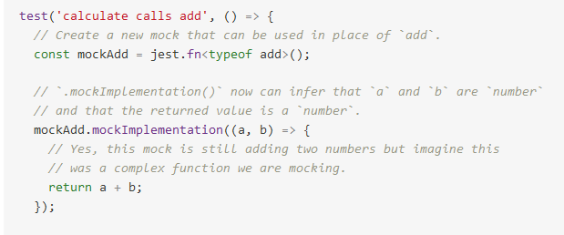
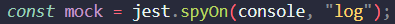
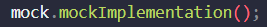
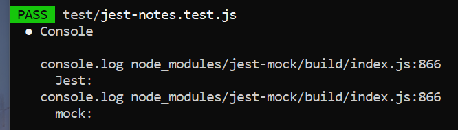
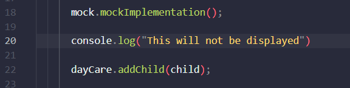
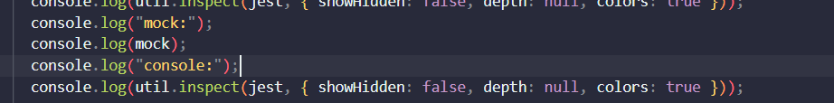
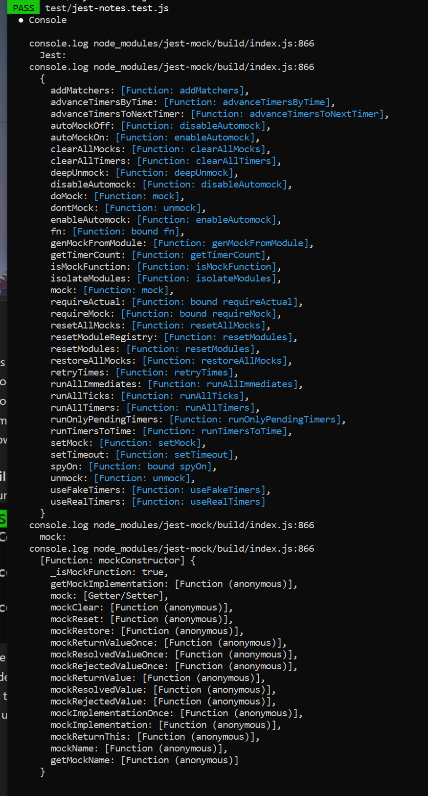
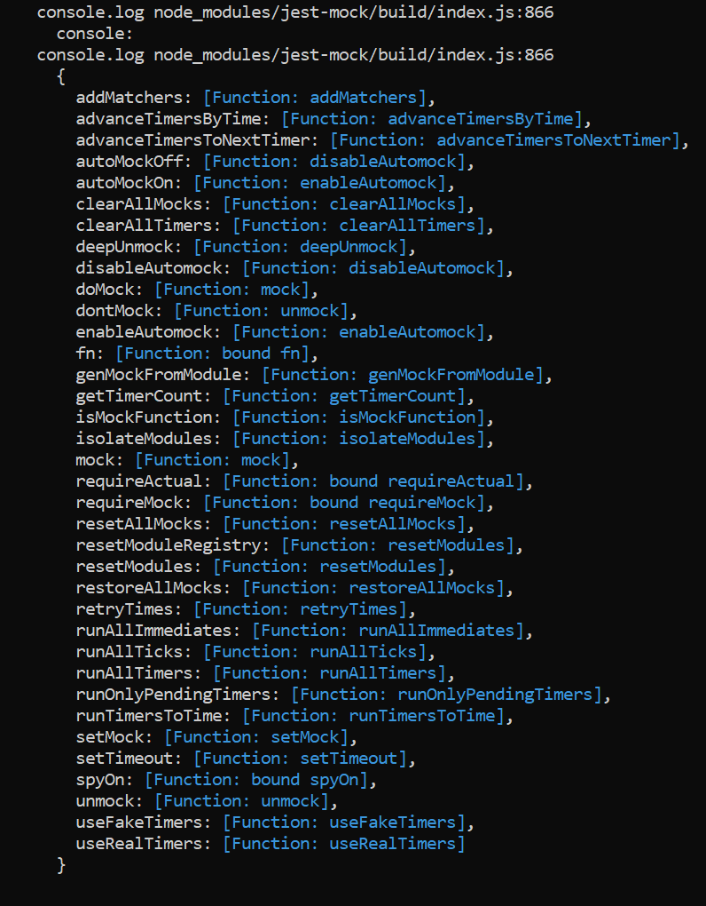

## `mockFn.mockImplementation(fn)`
#### focusing on mockFn
- "mockFn" from the example above is the function you are mocking, in other words, its the mock function
	- for example: jest.spyOn(console, "log") is MOCKING console.log()
	- In particular, "console" is a JS object and this code is mocking the use of the "log" method, it is making a mock function of console.log()

## `jest.fn(implementation?)`

- what exactly is a mock function though?
	- "Mock functions are also known as "spies", because they let you spy on the behavior of a function that is called indirectly by some other code, rather than only testing the output."
	- in the code snippet above, jest.fn is being use to mock some other function called add
	- I AM NOT SURE WHAT THIS WOULD BE USE FOR

##### instead of jest.fn lets look at how jest.spyOn can be used to mock functions
## `jest.spyOn(object, methodName)`
- "Creates a mock function similar to `jest.fn` but also tracks calls to `object[methodName]`. Returns a Jest [mock function](https://jestjs.io/docs/mock-function-api)." - jestjs.io
- the special part about jest.spyOn is tracking calls to stuff
- since we know "console" is an object and "log" is one of its methods jest.spyOn(console, "log") will track calls to that method 


## `mockFn.mockImplementation(fn)`
#### focusing on mockImplementation(fn)
- "Accepts a function that should be used as the implementation of the mock. The mock itself will still record all calls that go into and instances that come from itself" - jestjs.io
- fn in this example is the function that is being used AS THE IMPLEMENTATION
	- the implementation of console.log() is displaying in the console whatever is in the parentheses
- If there is no function provided to implement then the function it is mocking will do nothing

##### how is this used in activity 18 of module 10/OOP?
I made a new file in the folder test called jest-notes.test.js
line 1 
```
const DayCare = require("../dayCare");
const Child = require("../child");
const util = require("util");
```
- util will be used to inspect what jest is
	- inspect-ception?
line 4
```
describe("DayCare", () => {
  describe("addChild", () => {
    it("should not add a child over the 'ageLimit'", () => {
      const child = new Child("Tammy", 8);
      const dayCare = new DayCare();
      
      const mock = jest.spyOn(console, "log"); // important
      
      console.log("Jest:");
      // console.log(util.inspect(jest, { showHidden: false, depth: null, colors: true }));
      console.log("mock:");
      // console.log(mock);
      
      // mock.mockImplementation(); // important
      
      dayCare.addChild(child);
      expect(dayCare.children.length).toEqual(0);
      expect(mock).toBeCalledWith("Unable to add child, they are over the age limit");
      mock.mockRestore();
    });
  });
});
```
- mock is assigned a mock function using .spyOn 
	- mock will be mocking console.log()
	- mock will ALSO __track console.log() calls__
- mockImplementation is assigned NOTHING
	- now when console.log() is called, it(the log method) should do nothing

##### what will this do?
when I run "npm test" in the console, this will show up (we are focusing on the tests in jest-notes.test.js)

- now we can see when console.log was called
	- side note: no clue why 866 is displayed
- bellow that we can see its implementation -> console.log("Jest:") will display "Jest:" in the console

##### what is mockImplementation doing?
- on line 20 we are calling dayCare.addChild(child);
	- this SHOULD be using "console.log("Unable to add child, they are over the age limit")"
- on line 23 our test is expecting mock(this is detecting console.log() calls) to be called with a string in it
- in the console we can see that the test past and console.log was called with the given string in it
	- BUT the string is not displayed in the console
- our mock.mockImplementation(); allows us to change the implementation of console.log() into doing nothing

if we add this

the output in the console will be no different
and if we move mock.mockImplementation(); above all the console.log()'s then nothing will be logged

SIDE NOTE:  
- uncomment lines 12, 14, and 16 (the only commented lines) and run it again ->output for this is bellow 
- we should be able to see the "jest" and "mock" object that we are using
	- this time the implementation will display everything that these objects contain
we can also add

and see all the methods in console


added console.log(util.inspect(jest, { showHidden: false, depth: null, colors: true })); 
